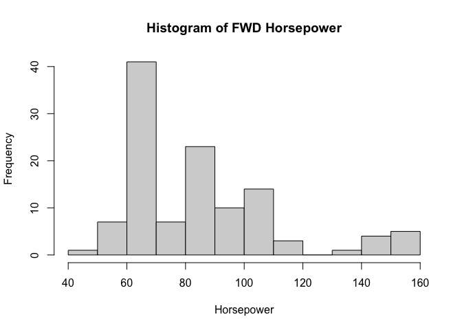
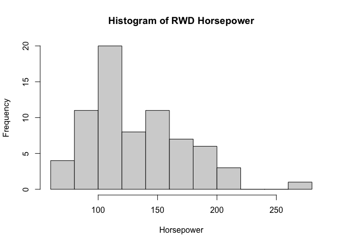
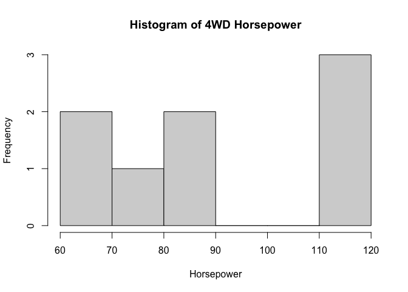
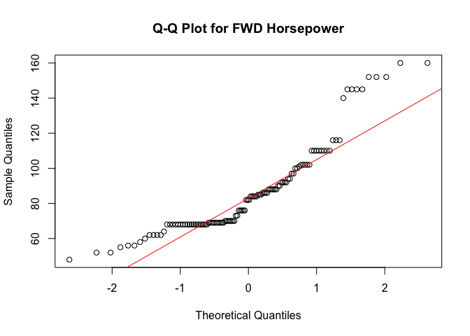
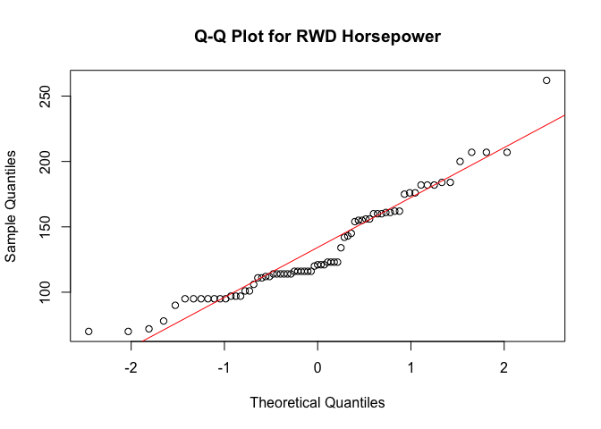
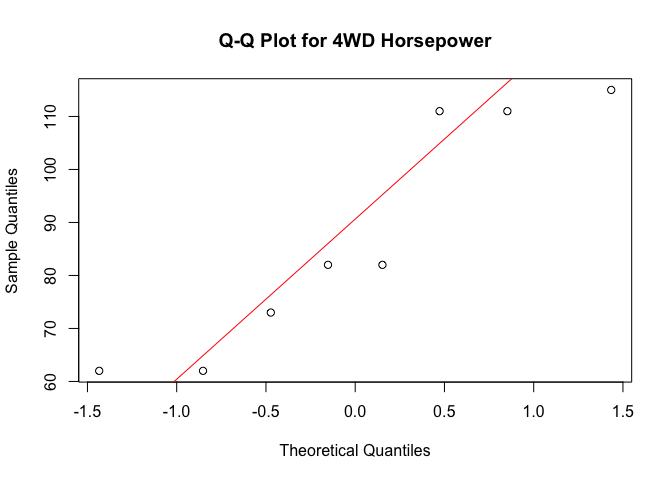
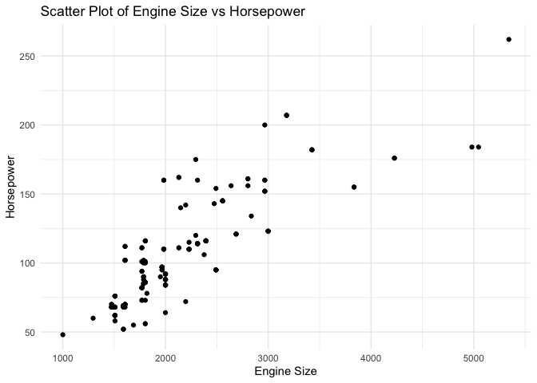

# Pitanje 1 - Snaga automobila ovisno o pogonu

**Je li snaga automobila s prednjim pogonom veća od automobila s drugim vrstama pogona?**

## Uvod

U istraživanju odgovora na ovo pitanje analiziramo kako tip pogona automobila utječe na njegovu snagu. Usredotočeni smo na usporedbu snage između vozila s prednjim pogonom (FWD), zadnjim pogonom (RWD) i pogonom na sve kotače (4WD). Korištenjem detaljnih podataka o automobilima, primjenjujemo statističke metode za razumijevanje ovih razlika. Cilj nam je pružiti dublji uvid u performanse automobila s obzirom na njihov tip pogona.

## Učitavanje podataka

Podaci o specifikacijama automobila učitavaju se iz CSV datoteke, pri čemu se uklanjaju svi redovi s nedostajućim vrijednostima, osiguravajući tako pouzdanost analize. Posebno se ističu atributi 'drive.wheel' i 'horsepower', koji su ključni za naše istraživanje o odnosu između tipa pogona automobila i njegove snage.

```r
cardata = read.csv('./datasets/car_specifications.csv')
cardata = na.omit(cardata)  # Remove any rows with missing values

head(cardata)
```

```
##         make aspiration num.of.doors  body.style drive.wheels engine.location
## 1 Alfa Romeo        std          two convertible          rwd           front
## 2 Alfa Romeo        std          two convertible          rwd           front
## 3 Alfa Romeo        std          two   hatchback          rwd           front
## 4       Audi        std         four       sedan          fwd           front
## 5       Audi        std         four       sedan          4wd           front
## 6       Audi        std          two       sedan          fwd           front
##   wheel.base length width height curb.weight engine.type num.of.cylinders
## 1      225.0  428.8 162.8  124.0        1156        dohc             four
## 2      225.0  428.8 162.8  124.0        1156        dohc             four
## 3      240.0  434.8 166.4  133.1        1280        ohcv              six
## 4      253.5  448.6 168.1  137.9        1060         ohc             four
## 5      252.5  448.6 168.7  137.9        1281         ohc             five
## 6      253.5  450.3 168.4  134.9        1137         ohc             five
##   engine.size fuel.system bore stroke compression.ratio horsepower peak.rpm
## 1        2130        mpfi 8.81   6.81               9.0        111     5000
## 2        2130        mpfi 8.81   6.81               9.0        111     5000
## 3        2491        mpfi 6.81   8.81               9.0        154     5000
## 4        1786        mpfi 8.10   8.64              10.0        102     5500
## 5        2229        mpfi 8.10   8.64               8.0        115     5500
## 6        2229        mpfi 8.10   8.64               8.5        110     5500
##   price city.L.100km highway.L.100km   fuel country continent
## 1 13495        11.19            8.70 petrol   Italy    Europe
## 2 16500        11.19            8.70 petrol   Italy    Europe
## 3 16500        12.37            9.04 petrol   Italy    Europe
## 4 13950         9.79            7.83 petrol Germany    Europe
## 5 17450        13.06           10.68 petrol Germany    Europe
## 6 15250        12.37            9.40 petrol Germany    Europe
```

## Histogrami

Generirajmo histograme koji vizualno prikazuju distribuciju snage motore za svaku kategoriju pogona automobila - prednji (FWD), zadnji (RWD) i pogon na sve kotače (4WD).
Histogrami omogućuju vizualnu analizu razlika u snazi između ovih triju kategorija.


```r
# Histograms of 'horsepower' for each 'drive.wheels' category
hist(cardata$horsepower[cardata$drive.wheels=='fwd'], main="Histogram of FWD Horsepower", xlab="Horsepower")
```

<!-- -->

```r
hist(cardata$horsepower[cardata$drive.wheels=='rwd'], main="Histogram of RWD Horsepower", xlab="Horsepower")
```

<!-- -->

```r
hist(cardata$horsepower[cardata$drive.wheels=='4wd'], main="Histogram of 4WD Horsepower", xlab="Horsepower")
```

<!-- -->

Za 4WD vozila, histogram prikazuje da većina automobila s ovim tipom pogona ima snagu koncentriranu oko manjih vrijednosti konjskih snaga (od 60 do 90 konjskih snaga), uz iznimku od 3 vozila sa snagom motora većom od 110 konjskih snaga.

Za FWD vozila, histogram prikazuje vrlo visoku frekvenciju u nižem rasponu snage, s vrhom oko 70 konjskih snaga. Distribucija je šira s nižom maksimalnom učestalošću, što ukazuje na veći raspon snage motora unutar ove kategorije, ali s tendencijom prema nižim vrijednostima snage.

Za RWD vozila, histogram prikazuje distribuciju srednje koncentriranu oko srednjeg raspona snage, s vrhom oko 150 konjskih snaga. Iako se snaga proteže do viših vrijednosti, većina automobila s RWD pogonom ima snagu unutar srednjeg raspona.

Ove distribucije ukazuju na različite filozofije dizajna i tržišne ciljeve proizvođača za svaki tip pogona. Na primjer, 4WD vozila su usmjerena na performanse i sposobnost terenske vožnje, dok su FWD vozila više usmjerena na ekonomičnost i praktičnost za svakodnevnu upotrebu. RWD vozila usmjerena da budu sportski automobili koji zahtijevaju uravnoteženu raspodjelu snage.

## Provjera normalnosti podataka

Provodimo analizu normalnosti podataka za varijablu 'horsepower' u skladu s različitim vrstama pogona vozila. Koristimo QQ-plotove za vizualizaciju distribucije 'horsepower' za pogon na prednjim (FWD), zadnjim (RWD) i četiri pogonska točka (4WD) te provodimo Kolmogorov-Smirnov test (u biblioteci se zove lillie tj. Lilliefors test) kako bismo provjerili normalnost podataka.


```r
# QQ-plots to check the normality of 'horsepower' distribution for different drive types
# QQ-plot for 'horsepower' for front-wheel drive (fwd)
qqnorm(cardata$horsepower[cardata$drive.wheels == 'fwd'], main = "Q-Q Plot for FWD Horsepower")
qqline(cardata$horsepower[cardata$drive.wheels == 'fwd'], col = "red")
```

<!-- -->

```r
# QQ-plot for 'horsepower' for rear-wheel drive (rwd)
qqnorm(cardata$horsepower[cardata$drive.wheels == 'rwd'], main = "Q-Q Plot for RWD Horsepower")
qqline(cardata$horsepower[cardata$drive.wheels == 'rwd'], col = "red")
```

<!-- -->

```r
# QQ-plot for 'horsepower' for four-wheel drive (4wd)
qqnorm(cardata$horsepower[cardata$drive.wheels == '4wd'], main = "Q-Q Plot for 4WD Horsepower")
qqline(cardata$horsepower[cardata$drive.wheels == '4wd'], col = "red")
```

<!-- -->

```r
# Load package for Lilliefors (Kolmogorov-Smirnov) normality test
require(nortest)
```

```
## Loading required package: nortest
```

```r
# Normality tests for 'horsepower' across different 'drive.wheels' categories
lillie.test(cardata$horsepower)
```

```
## 
## 	Lilliefors (Kolmogorov-Smirnov) normality test
## 
## data:  cardata$horsepower
## D = 0.12737, p-value = 3.598e-08
```

```r
lillie.test(cardata$horsepower[cardata$drive.wheels == 'fwd'])
```

```
## 
## 	Lilliefors (Kolmogorov-Smirnov) normality test
## 
## data:  cardata$horsepower[cardata$drive.wheels == "fwd"]
## D = 0.16274, p-value = 5.212e-08
```

```r
lillie.test(cardata$horsepower[cardata$drive.wheels == 'rwd'])
```

```
## 
## 	Lilliefors (Kolmogorov-Smirnov) normality test
## 
## data:  cardata$horsepower[cardata$drive.wheels == "rwd"]
## D = 0.19291, p-value = 6.33e-07
```

```r
lillie.test(cardata$horsepower[cardata$drive.wheels == '4wd'])
```

```
## 
## 	Lilliefors (Kolmogorov-Smirnov) normality test
## 
## data:  cardata$horsepower[cardata$drive.wheels == "4wd"]
## D = 0.23329, p-value = 0.2249
```

Rezultati QQ-plotova ukazuju na odstupanja od pretpostavke normalnosti za varijablu 'horsepower' u svim kategorijama pogona vozila, pri čemu se posebno izdvaja kategorija 4WD gdje se gotovo nijedan podatak ne podudara s linearnom linijom na QQ-plotu.

Iz rezultata Kolmogorov-Smirnov testova za normalnost varijable 'horsepower' za različite kategorije pogona vozila (FWD, RWD i 4WD) možemo izvući sljedeće zaključke:

1. Za ukupni skup podataka, p-vrijednost testa je vrlo niska (p-vrijednost ≈ 3.598e-08), što ukazuje na to da distribucija 'horsepower' varijable nije normalna.
2. Za kategoriju FWD, p-vrijednost je niska (p-vrijednost ≈ 5.212e-08), što ukazuje na to da distribucija 'horsepower' za ovu kategoriju nije normalna.
3. Za kategoriju RWD, p-vrijednost je niska (p-vrijednost ≈ 6.33e-07), što ukazuje na to da distribucija 'horsepower' za ovu kategoriju nije normalna.
4. Za kategoriju 4WD, p-vrijednost je relativno visoka (p-vrijednost ≈ 0.2249), što znači da nema dovoljno dokaza da distribucija 'horsepower' za ovu kategoriju nije normalna.

Na temelju ovih rezultata, zaključujemo da varijabla 'horsepower' ne ispunjava pretpostavku normalnosti distribucije u svim kategorijama pogona vozila (FWD, RWD i 4WD). Posebno se ističe kategorija 4WD, gdje nema dovoljno dokaza da distribucija 'horsepower' nije normalna, ali i dalje postoje znakovi odstupanja od normalnosti u ostalim kategorijama.

Unatoč padovima KS testova, uz naputak asistenta da QQ-plotovi ne izgledaju "loše", dalje ćemo provesti Barlettov test i t-testove kao da su podaci normalni.

## Barlettov test

U ovom dijelu analize primjenjujemo Barlettov test kako bismo provjerili homogenost varijanci varijable 'horsepower' u različitim kategorijama pogona vozila (FWD, RWD i 4WD). Također računamo varijance za 'horsepower' u svakoj od tih kategorija i prikazujemo distribuciju 'horsepower' putem boxplota kako bismo bolje razumjeli varijabilnost podataka unutar svake kategorije.

**Uvjeti za Barlettov test**
Kako bi proveli Barlettov test na podacima, prvo moramo biti sigurni da dani podaci zadovoljavaju sljedeće uvjete:

1. Normalnost 
2. Homogenost varijanci
3. Nezavisnost

**Huzpoteze**

$$H0:\ Nema\ statistički\ značajnih\ razlika\ u\ varijancama\ između\ grupa.
\\
H1:\ Postoje\ statistički\ značajne\ razlike\ u\ varijancama\ između\ grupa.$$

Uzimamo u obzir da su vozila u skupu podataka (retci) različita vozila i pretpostavljamo da su podatci nezavisni. Ironično, uvjet testa je da su varijance jednake, no bez obzira na taj zahtjev provodimo test kako bi vidjeli ima li ikakve razlike u varijancama između grupa i kolike su te razlike. 


```r
# Bartlett's test for homogeneity of variances across different 'drive.wheels' categories
bartlett.test(cardata$horsepower ~ cardata$drive.wheels)
```

```
## 
## 	Bartlett test of homogeneity of variances
## 
## data:  cardata$horsepower by cardata$drive.wheels
## Bartlett's K-squared = 16.972, df = 2, p-value = 0.0002063
```

```r
# Variance calculations for 'horsepower' in each 'drive.wheels' category
var(cardata$horsepower[cardata$drive.wheels == 'fwd'])
```

```
## [1] 635.9978
```

```r
var(cardata$horsepower[cardata$drive.wheels == 'rwd'])
```

```
## [1] 1481.587
```

```r
var(cardata$horsepower[cardata$drive.wheels == '4wd'])
```

```
## [1] 490.2143
```

```r
# Boxplot showing distribution of 'horsepower' across 'drive.wheels' categories
boxplot(cardata$horsepower ~ cardata$drive.wheels, main="Boxplot of Horsepower by Drive Wheels", xlab="Drive Wheels", ylab="Horsepower", col="cyan")
```

<!-- -->

**Bartlettov test za homogenost varijanci je pružio značajne rezultate:**

1. Testna statistika Bartlett's K-squared iznosi 16.972.
2. Broj stupnjeva slobode (df) je 2 (broj kategorija koje se uspoređuju - 1).
3. P-vrijednost (p-value) iznosi 0.0002063.
S obzirom na p-vrijednost manju od uobičajene statističke značajnosti od 0.05, odbacujemo nultu hipotezu koja sugerira homogenost varijanci između grupa. Ovaj rezultat ukazuje na statistički značajne razlike u varijancama između barem dvije kategorije pogona vozila.

**Na temelju izračunatih varijanci za varijablu 'horsepower' u različitim kategorijama pogona vozila, možemo izvući sljedeće zaključke:**

1. Vozila s prednjim pogonom (FWD) imaju relativno nisku varijancu snage motora ('horsepower') s vrijednošću od otprilike 635.9978. Ovo sugerira manju raznolikost snage motora unutar ove kategorije.
2. Vozila sa zadnjim pogonom (RWD) pokazuju znatno veću varijancu ('horsepower') koja iznosi približno 1481.587. To ukazuje na značajniju raspršenost snage motora među vozilima s zadnjim pogonom.
3. Kategorija vozila s pogonom na sva 4 kotača (4WD) ima umjerenu varijancu snage motora ('horsepower') koja iznosi otprilike 490.2143. Varijabilnost snage motora u ovoj kategoriji negdje je između FWD i RWD vozila.

Razlike u varijancama sugeriraju da postoji znatna varijabilnost snage motora između različitih kategorija pogona vozila, pri čemu RWD vozila pokazuju najveću varijancu.

Boxplot prikazuje raspodjelu snage motora u tri različite kategorije pogona vozila: pogon na sva četiri kotača (4WD), prednji pogon (FWD) i stražnji pogon (RWD).

Pogon na sva četiri kotača (4WD):
Kutija (interkvartilni raspon, IQR) je relativno uska, što ukazuje na manju varijabilnost snage motora unutar ove grupe.
Medijan (označen crtom unutar kutije) iznosi oko 100 konjskih snaga.
Nema vidljivih izvanrednih vrijednosti, što sugerira da sva vozila s pogonom na sva četiri kotača imaju snagu motora unutar relativno konzistentnog raspona.

Prednji pogon (FWD):
IQR je nešto veći nego kod 4WD-a, što ukazuje na veću varijabilnost.
Medijan snage motora nešto je niži nego kod 4WD-a, i nalazi se blizu 100 konjskih snaga.
Postoje neke izvanredne vrijednosti ispod donjeg whiskera, što ukazuje da neka vozila s prednjim pogonom imaju znatno manju snagu motora od ostalih.

Stražnji pogon (RWD):
Ova kategorija ima najširi IQR, što sugerira širok raspon vrijednosti snage motora.
Medijan je puno viši u usporedbi s druga dva, i nalazi se iznad 150 konjskih snaga.
Postoji nekoliko izvanrednih vrijednosti, i iznad i ispod kutije. Izvanredne vrijednosti iznad gornjeg whiskera ukazuju da neka vozila s pogonom na stražnjim kotačima imaju iznimno visoku snagu motora.

Općenito, vozila s pogonom na stražnjim kotačima obično imaju veću snagu motora s širim rasponom vrijednosti, dok vozila s pogonom na sva četiri kotača imaju manju varijabilnost i vozila s prednjim pogonom obično imaju manju snagu motora, s nekim iznimkama. Prisutnost izvanrednih vrijednosti, posebno u kategoriji vozila s pogonom na stražnjim kotačima, sugerira da postoje vozila s vrijednostima snage motora koje se značajno razlikuju od tipičnog raspona vrijednosti unutar te kategorije pogona na kotačima.

## Kruskal-Wallis test

Kako bismo istražili moguće razlike u snazi motora ('horsepower') između različitih kategorija pogona vozila, primjenili smo Kruskal-Wallis test. Ovaj test omogućuje statističku provjeru postojanja značajnih varijacija u snazi motora među tri različite kategorije pogonskih točkica.

**Pretpostavke Kruskal-Wallis testa su sljedeće:**

1. Grupe su nezavisne i slučajno uzorkovane.
2. Mjerenja su numerička ili ordinalna.

Ovaj test je neosjetljiv na normalnost distribucije podataka i homogenost varijanci te ga zato možemo provesti.

**Hipoteze:**
  $$H0: Nema\ statistički\ značajnih\ razlika\ između\ grupa.\\H1: Postoji\ statistički\ značajna\ razlika\ između\ najmanje\ jedne\ od\ grupa\ u\ usporedbi.$$


```r
# Kruskal-Wallis test to check for differences in 'horsepower' among the 3 drive wheel categories
kruskal.test(horsepower ~ drive.wheels, data = cardata)
```

```
## 
## 	Kruskal-Wallis rank sum test
## 
## data:  horsepower by drive.wheels
## Kruskal-Wallis chi-squared = 76.417, df = 2, p-value < 2.2e-16
```

Test daje statističku vrijednost chi-kvadrat od 76,417 sa 2 stupnja slobode. Izuzetno mala p-vrijednost, manja od 2.2e-16, ukazuje na statistički značajnu razliku u raspodjeli snage motora među tri kategorije pogonska. S obzirom na rezultate, možemo odbaciti nultu hipotezu da je medijan snage motora isti za kategorije 4WD, FWD i RWD. Drugim riječima, nije istina da nema statistički značajnih razlika između grupa. Zaključak ovog testa podupire vizualne nalaze iz boxplotova, gdje je uočeno da vozila sa stražnjim pogonom obično imaju veću snagu motora, što sugerira da postoji razlika u snazi motora između različitih vrsta pogona.

## T-test

Provodimo t-testove za usporedbu snage motora između različitih vrsta pogona vozila. Uspoređujemo snagu motora između vozila s prednjim pogonom (FWD), stražnjim pogonom (RWD) i pogonom na sva četiri kotača (4WD). Cilj ovih testova je provjeriti postoje li statistički značajne razlike u snazi motora između navedenih vrsta pogona vozila. Rezultati testova pružit će nam bolji uvid u to kako različite vrste pogona mogu utjecati na snagu motora u vozilima.

**T-test, koji se koristi za usporedbu srednjih vrijednosti dviju grupa, ima tri glavne pretpostavke:**

1. Normalnost distribucije
2. Homogenost varijanci
3. Nezavisnost uzoraka

Budući da varijance nisu homogene, koristimo opciju var.equal = FALSE pri provođenju testova.


```r
# T-test for 'horsepower' between fwd and rwd
t.test(cardata$horsepower[cardata$drive.wheels == 'fwd'], 
       cardata$horsepower[cardata$drive.wheels == 'rwd'], var.equal = FALSE)
```

```
## 
## 	Welch Two Sample t-test
## 
## data:  cardata$horsepower[cardata$drive.wheels == "fwd"] and cardata$horsepower[cardata$drive.wheels == "rwd"]
## t = -9.0854, df = 107.12, p-value = 5.927e-15
## alternative hypothesis: true difference in means is not equal to 0
## 95 percent confidence interval:
##  -56.81325 -36.46140
## sample estimates:
## mean of x mean of y 
##   86.2500  132.8873
```

```r
# T-test for 'horsepower' between rwd and 4wd
t.test(cardata$horsepower[cardata$drive.wheels == 'rwd'], 
       cardata$horsepower[cardata$drive.wheels == '4wd'], var.equal = FALSE)
```

```
## 
## 	Welch Two Sample t-test
## 
## data:  cardata$horsepower[cardata$drive.wheels == "rwd"] and cardata$horsepower[cardata$drive.wheels == "4wd"]
## t = 5.0354, df = 12.435, p-value = 0.0002614
## alternative hypothesis: true difference in means is not equal to 0
## 95 percent confidence interval:
##  25.96637 65.30828
## sample estimates:
## mean of x mean of y 
##  132.8873   87.2500
```

```r
# T-test for 'horsepower' between fwd and 4wd
t.test(cardata$horsepower[cardata$drive.wheels == 'fwd'], 
       cardata$horsepower[cardata$drive.wheels == '4wd'], var.equal = FALSE)
```

```
## 
## 	Welch Two Sample t-test
## 
## data:  cardata$horsepower[cardata$drive.wheels == "fwd"] and cardata$horsepower[cardata$drive.wheels == "4wd"]
## t = -0.12239, df = 8.3046, p-value = 0.9055
## alternative hypothesis: true difference in means is not equal to 0
## 95 percent confidence interval:
##  -19.72192  17.72192
## sample estimates:
## mean of x mean of y 
##     86.25     87.25
```

Rezultati niza Welchovih t-testova ukazuju na značajne razlike u snazi motora između različitih vrsta konfiguracija pogona vozila. U usporedbi između vozila s prednjim pogonom (FWD) i vozila s pogonom na stražnjim kotačima (RWD), statistika t-testa iznosi -9.0854 s p-vrijednošću od otprilike 5.93e-15, što ukazuje na statistički značajnu razliku u srednjoj snazi motora, pri čemu vozila s pogonom na stražnjim kotačima (RWD) imaju veću srednju snagu motora.

U usporedbi vozila s pogonom na stražnjim kotačima (RWD) i vozila s pogonom na sva četiri kotača (4WD), statistika t-testa iznosi 5.0354 s p-vrijednošću od 0.0002614, što ukazuje da vozila s pogonom na stražnjim kotačima (RWD) imaju značajno veću snagu motora od vozila s pogonom na sva četiri kotača (4WD).

Međutim, u usporedbi vozila vozila s prednjim pogonom (FWD) i vozila s pogonom na sva četiri kotača (4WD), statistika t-testa iznosi -0.12239 s visokom p-vrijednošću od 0.9055, što sugerira da nema statistički značajne razlike u snazi motora između ova dva tipa pogona.

Intervali pouzdanosti dodatno podupiru ove rezultate, prikazujući značajnu i nepreklapajuću razliku za prve dvije usporedbe te vrlo uzak i preklapajući raspon za usporedbu između FWD i 4WD vozila. Te su razlike prikazane u scatter plotovima u daljnoj analizi.

Rezulati analize dokazuju da dok vozila s pogonom na stražnjim kotačima obično imaju veću snagu motora od vozila s prednjim pogonom i vozila s pogonom na sva četiri kotača, vozila s prednjim pogonom i vozila s pogonom na sva četiri kotača su slična po snazi motora u prosjeku.

## Plotovi

Scatter plot se koristi za vizualizaciju odnosa između veličine motora i snage motora te za identifikaciju korelacija između njih. Density plot prikazuje kako se snaga motora distribuira unutar različitih tipova pogonska vozila, omogućujući usporedbu distribucija između tih kategorija. Oba grafikona pomažu u boljem razumijevanju podataka i otkrivanju obrazaca u specifikacijama vozila. Scatter plot pomaže u prepoznavanju odnosa između varijabli, dok density plot omogućuje analizu varijabilnosti snage motora među različitim grupama vozila.

Iz density plota vidimo proporcionalan odnos veličine motora i snage motora, dok u scatter plotu vidimo veliko preklapanje između snaga motora vozila s prednjim pogonom (FWD) i snaga motora vozila s pogonom na sva četiri kotača (4WD). Vozila sa zadnjim pogonom (RWD) se manje preklapaju s prva dva tipa pogona, a prema višim snagama nema preklapanja s drugim pogonima.


```r
# Installing and Loading ggplot2 package
options(repos = c(CRAN = "http://cran.rstudio.com"))
if (!requireNamespace("ggplot2", quietly = TRUE)) {
    install.packages("ggplot2")
}
library(ggplot2)
# Density plot
ggplot(cardata, aes(x = horsepower, fill = drive.wheels)) +
  geom_density(alpha = 0.5) +
  labs(title = "Density Plot of Horsepower by Drive Wheels",
       x = "Horsepower",
       y = "Density") +
  theme_minimal() +
  scale_fill_brewer(palette = "Set1")
```

<!-- -->

```r
# Scatter plot
ggplot(cardata, aes(x = engine.size, y = horsepower)) +
  geom_point() +
  labs(title = "Scatter Plot of Engine Size vs Horsepower",
       x = "Engine Size",
       y = "Horsepower") +
  theme_minimal()
```

<!-- -->

## Zaključak

Na temelju provedenih analiza, zaključujemo da tip pogona automobila značajno utječe na snagu motora. Rezultati Kruskal-Wallis testa i t-testova pokazali su da postoje statistički značajne razlike u snazi motora između vozila s različitim vrstama pogona. Vozila sa zadnjim pogonom (RWD) obično imaju veću snagu motora u usporedbi s vozilima s prednjim pogonom (FWD) i pogonom na sva četiri kotača (4WD). Ovo je vidljivo iz visokih vrijednosti medijana i veće varijance u snazi motora kod RWD vozila, što ukazuje na sklonost prema performansama i sportskoj orijentaciji.

S druge strane, vozila s prednjim pogonom (FWD) i pogonom na sva četiri kotača (4WD) pokazala su sličnu prosječnu snagu motora, što ukazuje na to da su ta vozila više usmjerena na uravnoteženost između ekonomičnosti i sposobnosti terenske vožnje. Ovo je potvrđeno t-testom između FWD i 4WD kategorija, gdje nije bilo statistički značajne razlike u prosječnoj snazi motora. Vizualne analize, uključujući histograme, boxplotove i density plot, dodatno su potvrdile ove nalaze.

U odgovoru na postavljeno pitanje, možemo zaključiti da automobili s prednjim pogonom (FWD) generalno nemaju veću snagu motora u usporedbi s ostalim vrstama pogona. U stvarnosti, automobili s RWD pogonom imaju tendenciju posjedovanja veće snage motora, dok su FWD i 4WD automobili sličniji po prosječnoj snazi motora.
